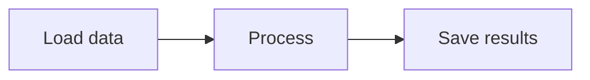

# Phase 1: Project Bootstrap + Diagram Core - Research

**Researched:** 2026-02-14
**Domain:** TypeScript project scaffolding, npm global package, Mermaid .mmd parsing/annotation system
**Confidence:** HIGH

## Summary

Phase 1 establishes the TypeScript foundation that every subsequent phase depends on. It has two distinct deliverables: (1) a correctly configured TypeScript project that compiles to a globally installable npm package with the `smartb` binary, and (2) a diagram service that can parse .mmd files, extract/inject `%% @flag` annotations, validate Mermaid syntax, and manage multiple files across project directories.

The technical challenge is well-understood. TypeScript ESM project scaffolding, npm global packaging, and text file parsing are all mature patterns with clear documentation. The primary risks are cross-platform path handling (30% of VS Code users are on Windows), static asset bundling for global installs (the `dist/public/` directory must be resolvable from any install location), and choosing the right approach for Mermaid syntax validation server-side (the full `mermaid` library requires a browser DOM).

**Primary recommendation:** Use a flat `src/` structure (not a monorepo) for Phase 1 since only one package is needed. Build with tsup (still functional despite being in maintenance mode -- tsdown is the successor but tsup remains stable and widely used). Parse .mmd files with custom regex-based parsing for the annotation layer, and use `@mermaid-js/parser` for syntax validation. Defer monorepo extraction to Phase 2 when the VS Code extension package is needed.

## Standard Stack

### Core

| Library | Version | Purpose | Why Standard |
|---------|---------|---------|--------------|
| TypeScript | ~5.9.x | Language + type checking | Latest stable. TS 6.0 beta is too new. `"moduleResolution": "Node16"` for ESM. |
| Node.js | >=22.x LTS | Runtime | Active LTS until 2027-04-30. Native `import.meta.dirname` support (since v20.11, stable in v22). |
| tsup | 8.5.x | Build/bundle | Wraps esbuild. Auto-handles shebang for CLI. Stable despite maintenance-mode status. |
| vitest | 4.x | Test runner | Native TS/ESM. Fast. Replaces Jest for greenfield. |
| commander | 14.x | CLI parsing | De facto standard for Node.js CLIs. Clean subcommand support. |

### Supporting

| Library | Version | Purpose | When to Use |
|---------|---------|---------|-------------|
| @mermaid-js/parser | 0.6.x | Mermaid syntax validation (server-side) | Validate .mmd content without browser DOM. Langium-based AST parser. |
| glob / fast-glob | 3.x / 5.x | File discovery | Find .mmd files in project directories. |
| picocolors | 1.x | Terminal colors | CLI output formatting. Lighter than chalk. |

### Alternatives Considered

| Instead of | Could Use | Tradeoff |
|------------|-----------|----------|
| tsup | tsdown | tsdown is tsup's official successor (Rolldown-based). tsup is unmaintained but stable. Use tsup for now -- migration to tsdown is automated via `npx tsdown-migrate`. Switch when tsdown reaches 1.0. |
| tsup | raw esbuild | More control, no wrapper overhead. But tsup's auto-shebang, DTS generation, and clean defaults save significant setup. |
| @mermaid-js/parser | @a24z/mermaid-parser | Community alternative, ~50KB. But official @mermaid-js/parser is from the Mermaid team and receives updates with Mermaid releases. |
| @mermaid-js/parser | Full mermaid lib | Requires browser DOM (JSDOM insufficient). Overkill for validation. |
| Custom regex parsing | @lifeomic/mermaid-simple-flowchart-parser | Limited to simple flowcharts. Custom regex gives full control over our annotation format. |
| Flat src/ structure | npm workspaces monorepo | Monorepo adds complexity with no benefit in Phase 1 (single package). Extract `core` package in Phase 2 if needed. |

**Installation:**

```bash
# Core dependencies
npm install commander

# Dev dependencies
npm install -D typescript@~5.9 tsup vitest @types/node @mermaid-js/parser picocolors
```

## Architecture Patterns

### Recommended Project Structure (Phase 1)

```
smartb-diagrams/
├── src/
│   ├── cli.ts              # Entry point: #!/usr/bin/env node + commander setup
│   ├── index.ts             # Public API exports (types, DiagramService)
│   ├── diagram/
│   │   ├── service.ts       # DiagramService class: read/write/parse/validate .mmd
│   │   ├── parser.ts        # Parse .mmd content: extract nodes, edges, subgraphs
│   │   ├── annotations.ts   # Parse/inject %% @flag annotations
│   │   ├── validator.ts     # Validate Mermaid syntax, return structured errors
│   │   └── types.ts         # TypeScript types: DiagramNode, Flag, Annotation, Status
│   ├── project/
│   │   ├── manager.ts       # ProjectManager: discover .mmd files, manage multiple projects
│   │   └── discovery.ts     # File discovery: glob for .mmd files in directories
│   └── utils/
│       ├── paths.ts         # Cross-platform path utilities (path.join everywhere)
│       └── logger.ts        # stderr-only logger (console.error wrapper)
├── static/                  # Static assets (HTML, CSS, JS) for browser UI
│   ├── live.html            # Browser UI (from prototype, adapted)
│   ├── annotations.js       # Flag system (from prototype, adapted)
│   ├── annotations.css      # Flag styles (from prototype)
│   └── diagram-editor.js    # Editor (from prototype, adapted)
├── test/
│   ├── diagram/
│   │   ├── service.test.ts
│   │   ├── parser.test.ts
│   │   ├── annotations.test.ts
│   │   └── validator.test.ts
│   ├── project/
│   │   └── manager.test.ts
│   └── fixtures/            # Sample .mmd files for testing
│       ├── valid-flowchart.mmd
│       ├── with-flags.mmd
│       ├── malformed.mmd
│       └── multi-project/
│           ├── project-a/diagram.mmd
│           └── project-b/diagram.mmd
├── package.json
├── tsconfig.json
├── tsup.config.ts
└── vitest.config.ts
```

### Structure Rationale

- **Flat `src/` not monorepo:** Phase 1 produces a single npm package. A `packages/core` + `packages/server` split adds workspace configuration complexity with zero benefit at this stage. When Phase 2 adds the HTTP server, the code simply goes into `src/http/`. If extraction into a shared `core` package is needed for the VS Code extension (Phase 7), it can happen then.
- **`static/` at project root:** Static assets are copied into `dist/static/` during build. The CLI resolves them via `import.meta.dirname` at runtime. Keeping them outside `src/` avoids them going through the TypeScript compiler.
- **`diagram/` module:** All .mmd file operations are in one place. The `service.ts` is the public API; `parser.ts`, `annotations.ts`, `validator.ts` are internal implementations.
- **`project/` module:** Multi-file and multi-project management. Discovers .mmd files, tracks which project directory each belongs to.
- **`utils/logger.ts`:** Stderr-only logging from day one. This prevents stdout pollution when the MCP server is added in Phase 5. Every module imports from here, never from `console.log`.

### Pattern 1: Annotation Block Format

**What:** `%% @flag` annotations are stored in a delimited block at the end of .mmd files, separated from Mermaid content by marker comments. This is the format established by the existing prototype.

**When to use:** Always -- this is the persistence format for all flag annotations.

**Format:**


**Parsing rules:**
1. Lines between `%% --- ANNOTATIONS ...` and `%% --- END ANNOTATIONS ---` are annotation lines
2. Each `%% @flag <nodeId> "<message>"` is a flag annotation
3. Everything outside the annotation block is Mermaid content
4. When writing, strip existing block, re-inject at end
5. Empty message is valid: `%% @flag B ""`

**Implementation:**
```typescript
// Source: Existing prototype annotations.js, ported to TypeScript
const ANNOTATION_START = '%% --- ANNOTATIONS (auto-managed by SmartB Diagrams) ---';
const ANNOTATION_END = '%% --- END ANNOTATIONS ---';
const FLAG_REGEX = /^%%\s*@flag\s+(\S+)\s+"([^"]*)"$/;

export function parseFlags(content: string): Map<string, Flag> {
  const flags = new Map<string, Flag>();
  const lines = content.split('\n');
  let inBlock = false;
  for (const line of lines) {
    const trimmed = line.trim();
    if (trimmed === ANNOTATION_START) { inBlock = true; continue; }
    if (trimmed === ANNOTATION_END) { inBlock = false; continue; }
    if (inBlock) {
      const match = trimmed.match(FLAG_REGEX);
      if (match) flags.set(match[1], { message: match[2], nodeId: match[1] });
    }
  }
  return flags;
}

export function stripAnnotations(content: string): string {
  const lines = content.split('\n');
  const result: string[] = [];
  let inBlock = false;
  for (const line of lines) {
    const trimmed = line.trim();
    if (trimmed === ANNOTATION_START) { inBlock = true; continue; }
    if (trimmed === ANNOTATION_END) { inBlock = false; continue; }
    if (!inBlock) result.push(line);
  }
  // Remove trailing blank lines
  while (result.length > 0 && result[result.length - 1].trim() === '') result.pop();
  return result.join('\n');
}

export function injectAnnotations(content: string, flags: Map<string, Flag>): string {
  const clean = stripAnnotations(content);
  if (flags.size === 0) return clean;
  const lines = ['', ANNOTATION_START];
  for (const [nodeId, { message }] of flags) {
    lines.push(`%% @flag ${nodeId} "${message.replace(/"/g, "''")}"` );
  }
  lines.push(ANNOTATION_END);
  return clean + '\n' + lines.join('\n');
}
```

### Pattern 2: DiagramService as Single Entry Point

**What:** A `DiagramService` class that encapsulates all .mmd file operations. All external consumers (CLI, HTTP server, MCP server in future phases) call DiagramService methods, never raw file I/O.

**When to use:** Always -- this is the core business logic layer.

**Example:**
```typescript
export class DiagramService {
  constructor(private readonly projectRoot: string) {}

  async readDiagram(filePath: string): Promise<DiagramContent> {
    const absPath = this.resolvePath(filePath);
    const raw = await fs.readFile(absPath, 'utf-8');
    const mermaidContent = stripAnnotations(raw);
    const flags = parseFlags(raw);
    const validation = await this.validate(mermaidContent);
    return { raw, mermaidContent, flags, validation, filePath };
  }

  async writeDiagram(filePath: string, content: string, flags?: Map<string, Flag>): Promise<void> {
    const absPath = this.resolvePath(filePath);
    const finalContent = flags ? injectAnnotations(content, flags) : content;
    await fs.mkdir(path.dirname(absPath), { recursive: true });
    await fs.writeFile(absPath, finalContent, 'utf-8');
  }

  async getFlags(filePath: string): Promise<Flag[]> {
    const { flags } = await this.readDiagram(filePath);
    return [...flags.values()];
  }

  async setFlag(filePath: string, nodeId: string, message: string): Promise<void> {
    const { mermaidContent, flags } = await this.readDiagram(filePath);
    flags.set(nodeId, { nodeId, message });
    await this.writeDiagram(filePath, mermaidContent, flags);
  }

  async validate(mermaidContent: string): Promise<ValidationResult> {
    // Use @mermaid-js/parser for syntax validation
    // Return structured errors with line numbers
  }

  private resolvePath(filePath: string): string {
    const resolved = path.resolve(this.projectRoot, filePath);
    // Security: ensure resolved path is within projectRoot
    if (!resolved.startsWith(this.projectRoot)) {
      throw new Error(`Path traversal detected: ${filePath}`);
    }
    return resolved;
  }
}
```

### Pattern 3: Cross-Platform Path Resolution for Static Assets

**What:** Use `import.meta.dirname` (native in Node.js 22+) to resolve the location of bundled static assets (HTML, CSS, JS) regardless of where the npm package is installed globally.

**When to use:** Whenever the CLI or server needs to locate static files bundled with the package.

**Example:**
```typescript
// src/utils/paths.ts
import path from 'node:path';

/**
 * Resolve path to static assets bundled with the package.
 * Works regardless of global/local install location.
 *
 * In development: import.meta.dirname points to src/utils/
 * In production (built): import.meta.dirname points to dist/
 * Static assets are always at ../static relative to the built output.
 */
export function getStaticDir(): string {
  return path.join(import.meta.dirname, '..', 'static');
}

export function getStaticFile(filename: string): string {
  return path.join(getStaticDir(), filename);
}
```

### Pattern 4: stderr-only Logger

**What:** All logging goes to stderr from day one. This is critical because when the MCP server is added in Phase 5, stdout becomes the JSON-RPC protocol channel. Any stdout write corrupts the MCP transport.

**When to use:** Always. Every file in the project imports from this logger, never uses `console.log` directly.

**Example:**
```typescript
// src/utils/logger.ts
import pc from 'picocolors';

export const log = {
  info: (...args: unknown[]) => console.error(pc.blue('[smartb]'), ...args),
  warn: (...args: unknown[]) => console.error(pc.yellow('[smartb]'), ...args),
  error: (...args: unknown[]) => console.error(pc.red('[smartb]'), ...args),
  debug: (...args: unknown[]) => {
    if (process.env.DEBUG) console.error(pc.dim('[smartb]'), ...args);
  },
};
```

### Anti-Patterns to Avoid

- **console.log() anywhere in the codebase:** Use the stderr logger from `utils/logger.ts`. When MCP is added in Phase 5, any stdout write corrupts the protocol. Build the habit now.
- **String concatenation for file paths:** Use `path.join()` and `path.resolve()` everywhere. String concatenation with `/` breaks on Windows.
- **__dirname in ESM:** Does not exist. Use `import.meta.dirname` (Node.js 22+) or `path.dirname(fileURLToPath(import.meta.url))` as a fallback.
- **Importing full `mermaid` library in Node.js:** Mermaid requires browser DOM APIs for rendering. Only use `@mermaid-js/parser` for server-side validation. Full Mermaid is loaded in the browser via CDN.
- **Hardcoding absolute paths in tests:** Use `path.join()` with test fixture directories. Tests must pass on macOS, Linux, and Windows.

## Don't Hand-Roll

| Problem | Don't Build | Use Instead | Why |
|---------|-------------|-------------|-----|
| CLI argument parsing | Custom process.argv parsing | `commander` v14 | Subcommand support, help generation, type coercion, error handling -- all solved. |
| TypeScript bundling | Custom tsc + file copying | `tsup` v8.5 | Auto-shebang, ESM output, DTS generation, clean builds in one tool. |
| .mmd file discovery | Custom recursive directory walk | `fast-glob` or `glob` | Handles gitignore patterns, symlinks, platform differences. |
| Terminal colors | ANSI escape codes | `picocolors` v1 | 1KB, handles NO_COLOR, FORCE_COLOR, pipe detection. |
| Mermaid syntax validation | Custom Mermaid grammar parser | `@mermaid-js/parser` | Official Langium-based parser. Extracts AST. Maintained with Mermaid releases. |

**Key insight:** The annotation parsing (`%% @flag`) IS custom -- it must be, because it is our own format. But everything around it (CLI, build, file discovery, Mermaid validation) has standard solutions.

## Common Pitfalls

### Pitfall 1: Static Assets Missing After Global Install

**What goes wrong:** Running `npm install -g .` installs the `smartb` command, but the HTML/CSS/JS files for the browser UI are not included. The server starts but returns 404 for the UI.

**Why it happens:** The `package.json` `files` field controls what npm packs. If `static/` or `dist/static/` is not listed, assets are excluded. Alternatively, the build step copies assets to `dist/static/` but the `files` field only includes `dist/*.js`.

**How to avoid:**
1. List both `dist` (compiled JS) and `dist/static` in `package.json` `files` field, OR just list `dist` (which includes everything under it)
2. Add a build step that copies `static/` to `dist/static/`
3. Verify with `npm pack --dry-run` -- check that HTML/CSS/JS files appear in the tarball listing
4. Add a CI check: `npm pack --dry-run | grep -q 'dist/static/live.html'`

**Warning signs:**
- `npm pack --dry-run` output missing expected files
- "Cannot find module" errors for HTML/CSS assets after global install
- Server works in development but not after `npm install -g .`

### Pitfall 2: import.meta.dirname Undefined in Built Output

**What goes wrong:** `import.meta.dirname` returns `undefined` at runtime after bundling with tsup/esbuild.

**Why it happens:** Some bundler configurations inline or transform `import.meta` expressions. If the output format is not ESM (`"type": "module"` in package.json), or if the bundler target strips `import.meta`, the property is not available.

**How to avoid:**
1. Set `"type": "module"` in `package.json`
2. Set `format: ['esm']` in `tsup.config.ts`
3. Set `platform: 'node'` in tsup config (ensures Node.js APIs are external)
4. Test the built output: `node dist/cli.js --version` should work
5. Fallback pattern: `import.meta.dirname ?? path.dirname(fileURLToPath(import.meta.url))`

**Warning signs:**
- `TypeError: Cannot read properties of undefined (reading 'dirname')` at runtime
- Works in development (running .ts directly) but breaks after build

### Pitfall 3: Path Traversal in File Operations

**What goes wrong:** The diagram service accepts a file path like `../../etc/passwd` and reads/writes outside the project directory.

**Why it happens:** File paths from user input (CLI arguments, future MCP tool calls, future REST API) are not validated against the project root.

**How to avoid:**
1. Resolve all paths with `path.resolve(projectRoot, filePath)`
2. Check that the resolved path starts with `projectRoot`
3. Reject any path containing `..` after normalization
4. Implement this in `DiagramService.resolvePath()` from day one -- every file operation goes through it

**Warning signs:**
- No path validation in file read/write methods
- Tests only use valid paths (no negative test cases)

### Pitfall 4: Annotation Block Corrupted by External Editors

**What goes wrong:** A developer manually edits the .mmd file in VS Code and accidentally modifies the `%% --- ANNOTATIONS ---` marker lines, or adds content between annotation markers that is not a valid `%% @flag` line.

**Why it happens:** The annotation block is plain text comments in the .mmd file. Nothing prevents users from editing them.

**How to avoid:**
1. Parse annotations tolerantly -- skip lines in the annotation block that do not match `FLAG_REGEX` rather than throwing
2. Preserve any unrecognized lines within the annotation block (treat as comments)
3. Re-serialize cleanly when writing back -- only output valid `%% @flag` lines
4. Log a warning (to stderr) when unrecognized lines are found in the annotation block

**Warning signs:**
- Parser throws on partially corrupted annotation blocks
- Flags disappear after the service writes back a file with corrupted annotations

### Pitfall 5: Binary Name Collision

**What goes wrong:** The `bin` field in `package.json` uses a name that conflicts with an existing command on the user's system.

**Why it happens:** The requirements specify the command name `smartb`. This is not a common command, but collisions can happen with locally installed tools.

**How to avoid:**
1. Register the npm package name `smartb-diagrams` (matches the repo)
2. Set `bin: { "smartb": "./dist/cli.js" }` -- the command is `smartb`, the package is `smartb-diagrams`
3. Verify `smartb` is not taken on npm as a separate package
4. Test: `npm install -g . && which smartb && smartb --version`

## Code Examples

### tsup.config.ts

```typescript
// Source: tsup documentation + CLI best practices
import { defineConfig } from 'tsup';

export default defineConfig({
  entry: ['src/cli.ts', 'src/index.ts'],
  format: ['esm'],
  target: 'node22',
  platform: 'node',
  dts: { entry: 'src/index.ts' },  // Only generate types for the library entry
  clean: true,
  shims: false,
  splitting: false,
  sourcemap: true,
  // tsup auto-detects shebang in src/cli.ts and preserves it
});
```

### package.json (Key Fields)

```json
{
  "name": "smartb-diagrams",
  "version": "0.1.0",
  "type": "module",
  "bin": {
    "smartb": "./dist/cli.js"
  },
  "main": "./dist/index.js",
  "types": "./dist/index.d.ts",
  "exports": {
    ".": {
      "import": "./dist/index.js",
      "types": "./dist/index.d.ts"
    }
  },
  "engines": {
    "node": ">=22"
  },
  "files": [
    "dist"
  ],
  "scripts": {
    "build": "tsup && cp -r static dist/static",
    "dev": "tsup --watch",
    "test": "vitest",
    "typecheck": "tsc --noEmit",
    "prepublishOnly": "npm run build",
    "verify-pack": "npm pack --dry-run"
  }
}
```

### tsconfig.json

```json
{
  "compilerOptions": {
    "target": "ES2022",
    "module": "Node16",
    "moduleResolution": "Node16",
    "lib": ["ES2022"],
    "outDir": "./dist",
    "rootDir": "./src",
    "strict": true,
    "esModuleInterop": true,
    "skipLibCheck": true,
    "forceConsistentCasingInFileNames": true,
    "resolveJsonModule": true,
    "declaration": true,
    "declarationMap": true,
    "sourceMap": true,
    "noUncheckedIndexedAccess": true,
    "noUnusedLocals": true,
    "noUnusedParameters": true
  },
  "include": ["src"],
  "exclude": ["node_modules", "dist", "test"]
}
```

### CLI Entry Point (src/cli.ts)

```typescript
#!/usr/bin/env node
import { Command } from 'commander';
import { log } from './utils/logger.js';

const program = new Command();

program
  .name('smartb')
  .description('AI observability diagrams -- see what your AI is thinking')
  .version('0.1.0');

// Phase 1: minimal command -- just verify the binary works
program
  .command('version')
  .description('Show version information')
  .action(() => {
    log.info('smartb-diagrams v0.1.0');
  });

// Future phases will add: init, serve, status

program.parse();
```

### TypeScript Types (src/diagram/types.ts)

```typescript
/** Status of a diagram node */
export type NodeStatus = 'ok' | 'problem' | 'in-progress' | 'discarded';

/** A flag annotation on a diagram node */
export interface Flag {
  nodeId: string;
  message: string;
  timestamp?: number;
}

/** A node in a Mermaid diagram */
export interface DiagramNode {
  id: string;
  label: string;
  shape: string;       // 'rect' | 'rounded' | 'circle' | 'diamond' | etc.
  status?: NodeStatus;
}

/** An edge between two nodes */
export interface DiagramEdge {
  from: string;
  to: string;
  label?: string;
  type: 'arrow' | 'open' | 'dotted' | 'thick';
}

/** Parsed content of a .mmd file */
export interface DiagramContent {
  /** The raw file content including annotations */
  raw: string;
  /** Mermaid content with annotations stripped */
  mermaidContent: string;
  /** Parsed flag annotations */
  flags: Map<string, Flag>;
  /** Validation result for the Mermaid syntax */
  validation: ValidationResult;
  /** Relative file path within the project */
  filePath: string;
}

/** Result of Mermaid syntax validation */
export interface ValidationResult {
  valid: boolean;
  errors: ValidationError[];
  diagramType?: string;  // 'flowchart', 'stateDiagram', etc.
}

/** A structured validation error */
export interface ValidationError {
  message: string;
  line?: number;
  column?: number;
}

/** A project containing .mmd files */
export interface Project {
  /** Absolute path to the project root directory */
  rootDir: string;
  /** Relative paths to .mmd files within the project */
  files: string[];
}
```

### Mermaid Syntax Validation (src/diagram/validator.ts)

```typescript
// Server-side validation using @mermaid-js/parser
// This parser works in Node.js without browser DOM
import { parse as mermaidParse } from '@mermaid-js/parser';
import type { ValidationResult, ValidationError } from './types.js';

export function validateMermaidSyntax(content: string): ValidationResult {
  try {
    // @mermaid-js/parser returns an AST if valid
    const ast = mermaidParse('flowchart', content);
    return {
      valid: true,
      errors: [],
      diagramType: 'flowchart',
    };
  } catch (error: unknown) {
    const errors: ValidationError[] = [];
    if (error instanceof Error) {
      // Extract line/column from error message if available
      const lineMatch = error.message.match(/line\s+(\d+)/i);
      const colMatch = error.message.match(/col(?:umn)?\s+(\d+)/i);
      errors.push({
        message: error.message,
        line: lineMatch ? parseInt(lineMatch[1], 10) : undefined,
        column: colMatch ? parseInt(colMatch[1], 10) : undefined,
      });
    }
    return {
      valid: false,
      errors,
      diagramType: undefined,
    };
  }
}
```

**Note on @mermaid-js/parser:** This is the official Langium-based parser from the Mermaid team. It produces an AST from Mermaid source. If it proves insufficient for flowchart validation (it may only support newer diagram types), fall back to a regex-based heuristic validator that checks:
1. First non-comment line starts with a valid diagram type (`flowchart`, `graph`, `stateDiagram`)
2. Node definitions match valid patterns (`ID["text"]`, `ID(text)`, etc.)
3. Edge definitions use valid arrow syntax (`-->`, `---`, `-.->`, `==>`)
4. Subgraph blocks have matching `subgraph ... end` pairs

### Static Asset Copy (Cross-Platform Build Script)

```json
{
  "scripts": {
    "build": "tsup && node -e \"const{cpSync}=require('fs');cpSync('static','dist/static',{recursive:true})\"",
    "build:unix": "tsup && cp -r static dist/static"
  }
}
```

Better approach -- use a `build.ts` script or tsup's `onSuccess`:

```typescript
// tsup.config.ts
import { defineConfig } from 'tsup';
import { cpSync } from 'node:fs';

export default defineConfig({
  entry: ['src/cli.ts', 'src/index.ts'],
  format: ['esm'],
  target: 'node22',
  platform: 'node',
  dts: { entry: 'src/index.ts' },
  clean: true,
  splitting: false,
  sourcemap: true,
  onSuccess: async () => {
    cpSync('static', 'dist/static', { recursive: true });
    console.error('[build] Static assets copied to dist/static/');
  },
});
```

## State of the Art

| Old Approach | Current Approach | When Changed | Impact |
|--------------|------------------|--------------|--------|
| `__dirname` / `__filename` | `import.meta.dirname` / `import.meta.filename` | Node.js 21 (stable in 22) | No need for `fileURLToPath` workaround in ESM. Simpler path resolution. |
| `path.dirname(fileURLToPath(import.meta.url))` | `import.meta.dirname` | Node.js 20.11+ | Direct replacement, cleaner code. |
| tsup (esbuild-based) | tsdown (Rolldown-based) | 2025-2026 | tsup is in maintenance mode. tsdown is the official successor. Migration is automated. Use tsup for now, migrate when tsdown reaches 1.0. |
| `zod@3.x` | `zod@4.x` | Late 2025 | Zod 4 changes imports. MCP SDK v1 still requires Zod 3. Use `zod@^3.25` until MCP migration. Not relevant for Phase 1. |
| Vitest 3.x | Vitest 4.x | Early 2026 | Requires Node 22+. Better performance, native ESM. |
| `console.log` for debugging | stderr-only logging | Always for MCP servers | Any stdout write corrupts MCP stdio transport. Build the habit from Phase 1. |

**Deprecated/outdated:**
- **tsup:** In maintenance mode. Still works, still receives bug fixes, but tsdown is the recommended successor. Safe to use for Phase 1 -- do not block on migrating.
- **`fileURLToPath(import.meta.url)` pattern:** Still works but unnecessary on Node.js 22+. Use `import.meta.dirname` directly.

## Open Questions

1. **@mermaid-js/parser flowchart support**
   - What we know: The package exports a `parse(diagramType, text)` function. It is Langium-based and produces an AST.
   - What's unclear: Which diagram types are fully supported. The package is at v0.6.x, suggesting pre-1.0 maturity. It may not parse all flowchart edge cases (new v11.3+ shape syntax like `@{ shape: name }`).
   - Recommendation: Try it first. If it fails on common flowchart patterns, fall back to a regex-based heuristic validator. The validator does not need to be perfect -- it should catch obvious syntax errors (missing arrow types, unclosed brackets) and return structured error messages. Browser-side Mermaid rendering will catch anything the validator misses.

2. **Build script cross-platform asset copy**
   - What we know: `cp -r` works on macOS/Linux. Windows needs a different approach.
   - What's unclear: Whether tsup's `onSuccess` hook with `cpSync` is sufficient, or if a build script (`node scripts/build.ts`) is cleaner.
   - Recommendation: Use `cpSync` from `node:fs` in tsup's `onSuccess` callback. This is cross-platform (Node.js built-in) and avoids shell commands.

3. **Bin name `smartb` availability**
   - What we know: The requirements spec says the command should be `smartb`.
   - What's unclear: Whether `smartb` conflicts with any existing npm package or system command.
   - Recommendation: Check `npm view smartb` before publishing. If taken, use `smartb-diagrams` as the bin name. For Phase 1 (local development only), `smartb` is fine.

## Sources

### Primary (HIGH confidence)
- [Node.js ESM documentation](https://nodejs.org/api/esm.html) -- `import.meta.dirname`, `import.meta.filename`, ESM module resolution
- [Node.js 22 release](https://www.infoq.com/news/2024/05/node-22-released/) -- ESM support, `import.meta.dirname` confirmed stable
- [Mermaid.js Flowchart Syntax](https://mermaid.js.org/syntax/flowchart.html) -- All node shapes, edge types, subgraph syntax, style directives
- [npm package.json docs](https://docs.npmjs.com/cli/v8/configuring-npm/package-json/) -- `files`, `bin`, `type`, `exports` fields
- [tsup documentation](https://tsup.egoist.dev/) -- Build configuration, shebang auto-detection, format options
- [commander.js](https://www.npmjs.com/package/commander) -- CLI argument parsing, subcommand support
- [Mermaid SSR Issue #3650](https://github.com/mermaid-js/mermaid/issues/3650) -- Confirms browser DOM requirement for rendering
- Project research: `.planning/research/STACK.md` -- Verified stack decisions
- Project research: `.planning/research/ARCHITECTURE.md` -- Verified architecture patterns
- Project research: `.planning/research/PITFALLS.md` -- Verified pitfall catalogue

### Secondary (MEDIUM confidence)
- [@mermaid-js/parser](https://www.npmjs.com/package/@mermaid-js/parser) -- Official Langium-based parser, v0.6.x
- [@a24z/mermaid-parser](https://www.npmjs.com/package/@a24z/mermaid-parser) -- Community lightweight validator, ~50KB
- [tsdown migration guide](https://tsdown.dev/guide/migrate-from-tsup) -- tsup successor, automated migration
- [tsup maintenance mode](https://github.com/egoist/tsup) -- README now recommends tsdown
- [LogRocket: __dirname alternatives in ESM](https://blog.logrocket.com/alternatives-dirname-node-js-es-modules/) -- ESM path resolution patterns
- [Sonar: __dirname is back](https://www.sonarsource.com/blog/dirname-node-js-es-modules/) -- `import.meta.dirname` adoption

### Tertiary (LOW confidence)
- [@lifeomic/mermaid-simple-flowchart-parser](https://www.npmjs.com/package/@lifeomic/mermaid-simple-flowchart-parser) -- Alternative parser, limited to simple flowcharts
- [RenderMaid](https://jsr.io/@rendermaid/core) -- AST parsing, available on JSR (not npm)

## Metadata

**Confidence breakdown:**
- Standard stack: HIGH -- All tools verified against official docs and npm registries. Versions confirmed current.
- Architecture: HIGH -- Patterns directly derived from project-level research and existing prototype code.
- Pitfalls: HIGH -- Cross-platform path handling, static asset bundling, and stderr logging are well-documented concerns with clear prevention strategies.
- Mermaid validation: MEDIUM -- `@mermaid-js/parser` is pre-1.0 and flowchart support depth is uncertain. Regex fallback is straightforward to implement.

**Research date:** 2026-02-14
**Valid until:** 2026-03-14 (stable domain, 30-day validity)
