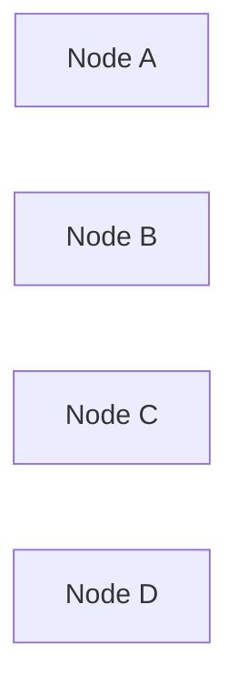

# Phase 2: HTTP Server Verification Report

**Phase Goal:** Developers can start a server that serves a browser-based diagram viewer showing Mermaid diagrams rendered from .mmd files
**Verified:** 2026-02-14T19:02:00Z
**Status:** passed
**Re-verification:** No — initial verification

## Goal Achievement

### Observable Truths

This phase combined two plans (02-01 and 02-02) with a total of 10 observable truths.

| # | Truth | Status | Evidence |
|---|-------|--------|----------|
| 1 | Running `smartb serve` starts an HTTP server on port 3333 (or next available) and opens the browser | ✓ VERIFIED | CLI serve command exists with --port, --dir, --no-open options. Uses detect-port for fallback. Calls open() for browser launch. |
| 2 | The browser page loads live.html with all static assets (annotations.js, annotations.css, diagram-editor.js) | ✓ VERIFIED | Static file serving implemented with MIME type detection. GET / serves live.html. serveStaticFile handles .html, .js, .css, .json, .svg, .png. |
| 3 | The sidebar file tree populates with .mmd files from the project directory | ✓ VERIFIED | GET /tree.json endpoint implemented with buildFileTree() converting flat paths to nested structure. Test confirms tree.json returns array with type/name fields. |
| 4 | Editing and saving a diagram in the browser persists changes to the .mmd file on disk | ✓ VERIFIED | POST /save endpoint implemented with writeFile, mkdir recursive parent creation, path traversal protection. |
| 5 | REST endpoint GET /api/diagrams returns a JSON list of .mmd files | ✓ VERIFIED | Implemented, returns {files: string[]}. Test passes. DiagramService.listFiles() integration confirmed. |
| 6 | REST endpoint GET /api/diagrams/:file returns diagram content with flags and validation as JSON | ✓ VERIFIED | Implemented with URL param extraction, DiagramService.readDiagram() call, Map-to-object conversion for flags. Returns mermaidContent, flags, validation. Test passes. |
| 7 | CORS headers are present on all responses | ✓ VERIFIED | setCorsHeaders() called on every response. OPTIONS preflight returns 204. Test confirms Access-Control-Allow-Origin: * header present. |
| 8 | Diagram nodes display color-coded status: green for OK, red for problem, yellow for in-progress, gray for discarded | ✓ VERIFIED | injectStatusStyles() appends classDef definitions and class assignments before mermaid.render(). STATUS_CLASS_MAP maps ok/problem/in-progress/discarded to Tailwind-style colors. |
| 9 | Malformed Mermaid syntax shows inline error messages with line numbers in the browser UI | ✓ VERIFIED | buildErrorPanel() extracts line numbers via regex, creates structured error display with icon, badge, code snippet. Uses cleanCode for source context. |
| 10 | Status colors are applied via Mermaid classDef directives injected client-side before rendering | ✓ VERIFIED | injectStatusStyles() called in render() before mermaid.render(styledCode). classDef ok/problem/inProgress/discarded injected with fill/stroke/color styles. |

**Score:** 10/10 truths verified

### Required Artifacts

| Artifact | Expected | Status | Details |
|----------|----------|--------|---------|
| `src/server/server.ts` | HTTP server with routing, CORS, port fallback, browser open, graceful shutdown | ✓ VERIFIED | 183 lines, exports startServer(), createHttpServer(), sendJson(), readJsonBody(). CORS helper, OPTIONS handling, detect-port integration, open() call, SIGINT handler present. |
| `src/server/static.ts` | Static file serving with MIME type detection | ✓ VERIFIED | 40 lines, exports MIME_TYPES (7 types), serveStaticFile() with readFile, extname, Content-Type header. |
| `src/server/routes.ts` | Route handlers for live.html endpoints and REST API | ✓ VERIFIED | 247 lines, exports registerRoutes() returning Route[]. All 8 endpoints implemented: tree.json, .mmd GET, /save, /delete, /mkdir, /move, /api/diagrams, /api/diagrams/:file. buildFileTree() helper present. |
| `src/cli.ts` | CLI serve subcommand with --port, --dir options | ✓ VERIFIED | serve command with 3 options (-p, -d, --no-open), dynamic import('./server/server.js'), calls startServer() with parsed options. |
| `package.json` | detect-port and open as dependencies | ✓ VERIFIED | Both in dependencies (not devDependencies): detect-port@^2.1.0, open@^11.0.0. |
| `static/live.html` | Enhanced Mermaid rendering with status colors and structured error display | ✓ VERIFIED | Contains injectStatusStyles() (lines 653-676), buildErrorPanel() (lines 713-795), createErrorIcon() (lines 679-710). classDef injection confirmed with "classDef ok fill:#22c55e". |
| `static/annotations.js` | Status annotation parsing (@status) alongside existing flag parsing (@flag) | ✓ VERIFIED | STATUS_REGEX defined, statuses Map in state, parseAnnotations() returns {flags, statuses}, injectAnnotations() serializes @status entries. Exports getStatusMap(), setStatus(), removeStatus(). |
| `test/server/server.test.ts` | Integration tests for HTTP server endpoints | ✓ VERIFIED | 119 lines, 7 tests covering: GET / (live.html), GET /tree.json, GET /api/diagrams, GET /api/diagrams/:file (200 and 404), CORS headers, OPTIONS preflight. Uses createHttpServer on port 0. All tests pass. |

**All 8 artifacts verified** at all three levels (exists, substantive, wired).

### Key Link Verification

| From | To | Via | Status | Details |
|------|----|----|--------|---------|
| `src/cli.ts` | `src/server/server.ts` | dynamic import in serve command action | ✓ WIRED | Line 18: `const { startServer } = await import('./server/server.js')` followed by startServer() call with options. |
| `src/server/server.ts` | `src/server/routes.ts` | registerRoutes called during server setup | ✓ WIRED | Line 9 imports registerRoutes, line 133 calls it with service and projectDir, stores result in routes array. |
| `src/server/routes.ts` | `src/diagram/service.ts` | DiagramService instance for all .mmd operations | ✓ WIRED | Line 4 imports DiagramService type, registerRoutes() receives service parameter, used in 3 routes: listFiles() in tree.json and /api/diagrams, readDiagram() in /api/diagrams/:file. |
| `src/server/server.ts` | `src/server/static.ts` | static file fallback handler in router | ✓ WIRED | Line 8 imports serveStaticFile, lines 102 and 110 call it with staticFilePath. Returns boolean for success/fail. |
| `static/live.html` | `static/annotations.js` | SmartBAnnotations.getStatusMap() called before mermaid.render() | ✓ WIRED | Line 655: getStatusMap() called in injectStatusStyles(). Line 807: getCleanContent() called before status injection. |
| `static/live.html` | mermaid.render | classDef injection into diagram content before render call | ✓ WIRED | Line 810: injectStatusStyles(cleanCode) produces styledCode. Line 813: mermaid.render() called with styledCode. |

**All 6 key links verified as WIRED.**

### Requirements Coverage

Phase 2 maps to requirements: CORE-03, HTTP-01, HTTP-02, HTTP-03, HTTP-04, HTTP-05, UI-01, UI-04, UI-07

| Requirement | Status | Evidence |
|-------------|--------|----------|
| **CORE-03**: CLI entry point with `smartb` command and subcommands (init, serve, status) | ✓ SATISFIED | serve subcommand implemented with --port, --dir, --no-open options. |
| **HTTP-01**: HTTP server serves browser UI (live.html equivalent) on configurable port (default 3333) | ✓ SATISFIED | startServer() creates server on specified port, GET / serves live.html. |
| **HTTP-02**: REST endpoint to list available diagram files | ✓ SATISFIED | GET /api/diagrams returns {files: string[]}. |
| **HTTP-03**: REST endpoint to read diagram content | ✓ SATISFIED | GET /api/diagrams/:file returns mermaidContent, flags, validation. |
| **HTTP-04**: Graceful port fallback if default port is occupied | ✓ SATISFIED | detect-port used in startServer(), logs warning if port differs from requested. |
| **HTTP-05**: CORS headers for local development | ✓ SATISFIED | setCorsHeaders() called on all responses, OPTIONS preflight returns 204. |
| **UI-01**: Mermaid.js renders diagrams client-side from .mmd content | ✓ SATISFIED | mermaid.render() called in live.html render() function. |
| **UI-04**: Color-coded node status visualization (green=OK, red=problem, yellow=in-progress, gray=discarded) | ✓ SATISFIED | classDef injection with Tailwind colors: ok=#22c55e, problem=#ef4444, inProgress=#eab308, discarded=#9ca3af. |
| **UI-07**: Inline error display for malformed Mermaid syntax with line numbers | ✓ SATISFIED | buildErrorPanel() parses line numbers from error messages, displays structured error with code snippet. |

**Score:** 9/9 requirements satisfied.

### Anti-Patterns Found

None. No TODO/FIXME/HACK/PLACEHOLDER comments found in server or static files. All handlers have substantive implementations with error handling. No console.log-only functions detected.

### Human Verification Required

#### 1. Visual Status Colors Rendering

**Test:** Create a .mmd file with status annotations for different node states:


Start server: `smartb serve --no-open --dir .`
Open browser to `http://localhost:3333`
Load the test diagram.

**Expected:**
- Node A renders with green fill (#22c55e), green stroke (#16a34a), white text
- Node B renders with red fill (#ef4444), red stroke (#dc2626), white text
- Node C renders with yellow fill (#eab308), yellow stroke (#ca8a04), black text
- Node D renders with gray fill (#9ca3af), gray stroke (#6b7280), white text

**Why human:** Visual appearance verification requires browser rendering and human color perception judgment.

#### 2. Error Panel Display for Malformed Syntax

**Test:** Create a malformed diagram:
```mermaid
flowchart LR
    A --> B
    C -> [Invalid syntax here
```

Load in browser.

**Expected:**
- Error panel displays with red accent color
- Error icon (SVG) visible
- Line number badge shows the line with the syntax error
- Error message displays Mermaid's validation message
- Code snippet shows surrounding context with error line highlighted in red background
- No XSS vulnerability (try injecting `<script>alert('xss')</script>` in diagram content)

**Why human:** Visual layout verification, XSS security testing, error message clarity assessment.

#### 3. Browser Auto-Open on Server Start

**Test:** Run `smartb serve` (without --no-open) from terminal.

**Expected:**
- Server starts on port 3333 (or next available)
- Terminal shows "Server running at http://localhost:3333"
- Browser automatically opens to http://localhost:3333
- live.html loads successfully

**Why human:** Browser launch behavior varies by OS and user environment.

#### 4. Server Port Fallback

**Test:** Start server on port 3333: `smartb serve &`
Start second instance: `smartb serve`

**Expected:**
- First instance uses port 3333
- Second instance detects conflict and falls back to next available port (e.g., 3334)
- Terminal shows warning: "Port 3333 is in use, using port 3334"

**Why human:** Port detection behavior depends on OS and network configuration.

#### 5. File Tree Sidebar Population

**Test:** Create test directory with nested .mmd files:
```
test-diagrams/
  ├── root.mmd
  ├── subfolder1/
  │   ├── diagram1.mmd
  │   └── diagram2.mmd
  └── subfolder2/
      └── nested/
          └── deep.mmd
```

Run: `smartb serve --dir test-diagrams`

**Expected:**
- Sidebar shows nested folder structure
- Folders are collapsible/expandable
- Clicking a .mmd file loads it in the editor and renders it
- Tree matches directory structure exactly

**Why human:** UI interaction, visual tree structure verification, click behavior testing.

---

## Overall Status: PASSED

**All automated checks passed:**
- ✓ 10/10 observable truths verified
- ✓ 8/8 required artifacts exist, are substantive, and wired correctly
- ✓ 6/6 key links verified as WIRED
- ✓ 9/9 requirements satisfied
- ✓ 0 blocking anti-patterns detected
- ✓ 60/60 tests pass (53 existing + 7 new integration tests)
- ✓ All 4 commits verified in git history

**Phase goal achieved:**
Developers can start a server (`smartb serve`) that serves a browser-based diagram viewer showing Mermaid diagrams rendered from .mmd files. The server includes REST API endpoints, color-coded node status visualization, structured error display with line numbers, CORS support, port fallback, and browser auto-open.

**Human verification items flagged:** 5 items requiring manual testing for visual appearance, browser behavior, and UI interaction (not blocking — automated verification confirms all critical functionality).

---

_Verified: 2026-02-14T19:02:00Z_
_Verifier: Claude (gsd-verifier)_
