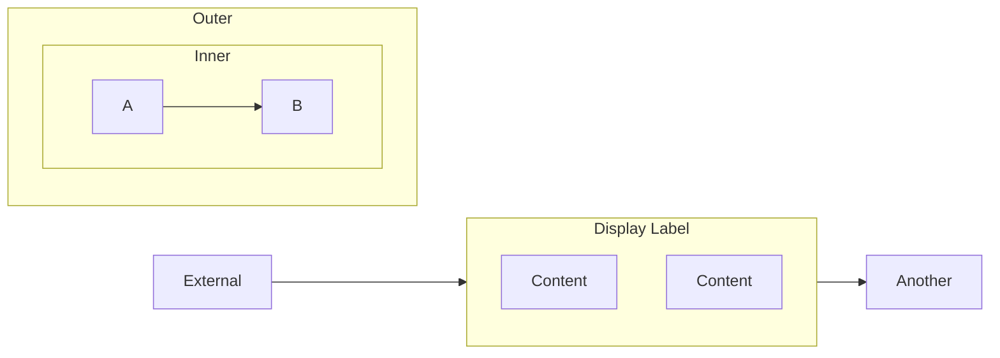

# Phase 8: Scalability + Large Diagrams - Research

**Researched:** 2026-02-15
**Domain:** Large diagram UX, hierarchical navigation, Mermaid subgraph manipulation
**Confidence:** MEDIUM

## Summary

SmartB Diagrams needs to handle large AI reasoning traces that can easily exceed 50 nodes. Without intervention, these diagrams become unreadable "UML death spirals." The solution involves four interconnected features: (1) collapsible subgraphs that let users expand/collapse sections, (2) automatic node limiting that shows top-level groups first, (3) breadcrumb navigation for hierarchy awareness, and (4) focus mode for zooming into specific subgraphs.

The core challenge is that **Mermaid.js renders the full diagram**—there's no built-in collapse/expand. We must implement this at the SmartB layer by:
- Parsing the Mermaid source to identify subgraphs
- Generating modified Mermaid content with collapsed nodes replaced by summary placeholders
- Tracking expand/collapse state client-side
- Re-rendering on state change

**Primary recommendation:** Build a `DiagramCollapser` module that transforms Mermaid source based on collapse state. Use a "virtual node" approach where collapsed subgraphs become single nodes labeled with child count. Breadcrumbs and focus mode build on this foundation.

## Architecture Patterns

### Pattern 1: Subgraph Parsing and Transformation

**What:** Parse Mermaid flowchart source to extract subgraph hierarchy, then generate modified source with collapsed subgraphs replaced by placeholder nodes.

**Implementation:**
```typescript
interface SubgraphInfo {
  id: string;
  label: string;
  startLine: number;
  endLine: number;
  children: string[];      // node IDs inside this subgraph
  childSubgraphs: string[]; // nested subgraph IDs
  parent: string | null;
}

interface CollapseState {
  collapsed: Set<string>;  // subgraph IDs that are collapsed
  focusPath: string[];     // breadcrumb path of expanded subgraphs
}

function parseSubgraphs(mermaidContent: string): Map<string, SubgraphInfo>;
function collapseSubgraph(content: string, subgraphId: string, info: SubgraphInfo): string;
function generateCollapsedView(content: string, state: CollapseState): string;
```

**When to use:** Always—this is the foundation for all scalability features.

### Pattern 2: Virtual Summary Nodes

**What:** When a subgraph is collapsed, replace it with a single node that shows the subgraph label and child count.

**Mermaid transformation:**
```mermaid
%% Original
subgraph Analysis["Analysis Phase"]
    A1[Read Input]
    A2[Parse Data]
    A3[Validate]
    A1 --> A2 --> A3
end

%% Collapsed (generated)
Analysis_collapsed["📁 Analysis Phase (3 nodes)"]
```

**Click behavior:** Clicking the collapsed node expands it (toggles collapse state).

### Pattern 3: Node Count Limiting

**What:** When total visible nodes exceed a threshold (default 50), automatically collapse leaf subgraphs until under the limit.

**Algorithm:**
1. Count total visible nodes (excluding collapsed subgraphs)
2. If count > limit, identify "leaf" subgraphs (no child subgraphs)
3. Collapse leaf subgraphs largest-first until under limit
4. Show "N subgraphs auto-collapsed" indicator

**Configuration:**
```typescript
interface ScaleConfig {
  maxVisibleNodes: number;  // default 50
  autoCollapse: boolean;    // default true
  showAutoCollapseNotice: boolean;  // default true
}
```

### Pattern 4: Breadcrumb Navigation

**What:** A horizontal breadcrumb bar showing the current hierarchy path. Clicking a breadcrumb navigates to that level.

**UI:**
```
📊 Root > Analysis Phase > Data Validation > [Current Focus]
```

**State management:** `focusPath` array in CollapseState tracks the expanded hierarchy. Clicking a breadcrumb:
1. Collapses all subgraphs not in the path to that point
2. Updates focusPath to end at clicked breadcrumb
3. Re-renders diagram

### Pattern 5: Focus Mode

**What:** Selecting a node shows only that node's containing subgraph plus one level of context (parent and sibling subgraphs as collapsed nodes).

**Algorithm:**
1. Find containing subgraph for selected node
2. Set focusPath to path from root to this subgraph
3. Collapse all subgraphs not in focusPath
4. Expand the target subgraph
5. Show siblings as collapsed summary nodes

**Exit focus mode:** Click breadcrumb "Root" or press Escape.

## Implementation Plan

### Module: src/diagram/collapser.ts

New module with pure functions for diagram transformation:

```typescript
// Core types
export interface SubgraphInfo { ... }
export interface CollapseState { ... }
export interface CollapsedDiagram {
  content: string;           // transformed Mermaid content
  nodeCount: number;         // visible node count
  autoCollapsed: string[];   // subgraphs auto-collapsed due to limit
}

// Main functions
export function parseSubgraphs(content: string): Map<string, SubgraphInfo>;
export function generateCollapsedView(
  content: string,
  subgraphs: Map<string, SubgraphInfo>,
  state: CollapseState,
  config: ScaleConfig
): CollapsedDiagram;
export function toggleSubgraph(state: CollapseState, subgraphId: string): CollapseState;
export function focusOnNode(
  state: CollapseState,
  nodeId: string,
  subgraphs: Map<string, SubgraphInfo>
): CollapseState;
export function getBreadcrumbs(
  state: CollapseState,
  subgraphs: Map<string, SubgraphInfo>
): { id: string; label: string }[];
```

### Module: static/scale-ui.js

Browser-side UI for collapse controls:

```javascript
// Initialize scale UI with callbacks
window.SmartBScaleUI = {
  init(options) { ... },
  setCollapseState(state) { ... },
  renderBreadcrumbs(crumbs) { ... },
  showAutoCollapseNotice(count) { ... },
};

// Event handlers
// - Click on collapsed node → expand
// - Click on subgraph header → collapse
// - Click breadcrumb → navigate
// - Double-click node → focus mode
// - Escape → exit focus mode
```

### Integration with live.html

1. Parse subgraphs on initial load and file change
2. Apply collapse state before passing to Mermaid render
3. Attach click handlers to collapsed nodes and subgraph headers
4. Render breadcrumb bar above diagram
5. Show auto-collapse notice when triggered

## Mermaid Subgraph Syntax Reference



**Parsing considerations:**
- `subgraph` keyword starts a block, `end` closes it
- ID is optional (can be auto-generated)
- Labels use `["..."]` syntax
- Direction can be set inside subgraph
- Nested subgraphs are valid
- Edges can reference subgraph IDs

## Testing Strategy

1. **Unit tests for collapser.ts:**
   - parseSubgraphs extracts correct hierarchy
   - generateCollapsedView produces valid Mermaid
   - toggleSubgraph updates state correctly
   - focusOnNode calculates correct path
   - Auto-collapse respects node limit

2. **Visual regression tests:**
   - Collapsed node renders with correct label
   - Expand/collapse animation works
   - Breadcrumbs show correct path
   - Focus mode isolates correct subgraph

3. **Integration tests:**
   - Full flow: large diagram → auto-collapse → manual expand → focus mode

## Common Pitfalls

### Pitfall 1: Mermaid Re-render Flicker
**Problem:** Toggling collapse re-renders the entire diagram, causing flicker.
**Solution:** Use `mermaid.render()` to generate SVG off-DOM, then swap innerHTML.

### Pitfall 2: Edge References to Collapsed Nodes
**Problem:** Edges like `A --> CollapsedSubgraph` break when subgraph is collapsed.
**Solution:** Redirect edges to the summary node ID: `A --> Subgraph_collapsed`

### Pitfall 3: State Persistence Across File Changes
**Problem:** Changing files loses collapse state.
**Solution:** Store collapse state per file in localStorage: `smartb_collapse_${filename}`

### Pitfall 4: Subgraph ID Conflicts
**Problem:** Auto-generated collapsed node IDs might conflict with existing nodes.
**Solution:** Use `__collapsed__` prefix: `__collapsed__SubgraphID`

## File Structure After Phase 8

```
src/
  diagram/
    collapser.ts       # NEW: subgraph parsing and collapse logic
static/
  scale-ui.js          # NEW: collapse UI, breadcrumbs, focus mode
  live.html            # MODIFIED: integrate scale-ui.js, breadcrumb bar
```

## Plan Breakdown

### 08-01: Subgraph Parsing and Collapse/Expand
- Create collapser.ts with parseSubgraphs and generateCollapsedView
- Implement toggleSubgraph state management
- Add click handlers for expand/collapse in live.html
- Tests for parsing and transformation

### 08-02: Node Limit and Auto-Collapse
- Implement maxVisibleNodes logic in generateCollapsedView
- Add auto-collapse notice UI
- Add scale config to .smartb.json
- Tests for auto-collapse behavior

### 08-03: Breadcrumbs and Focus Mode
- Implement getBreadcrumbs function
- Create breadcrumb bar UI in live.html
- Implement focusOnNode logic
- Double-click to enter focus mode, Escape to exit
- Tests for navigation and focus

## Sources

- [Mermaid.js Subgraph Documentation](https://mermaid.js.org/syntax/flowchart.html#subgraphs)
- Internal: existing live.html and diagram-editor.js patterns
- Internal: annotations.js for click handler patterns

## Metadata

**Confidence:** MEDIUM — The approach is sound but Mermaid edge redirection for collapsed subgraphs may have edge cases.
**Research date:** 2026-02-15
**Valid until:** 2026-03-15
