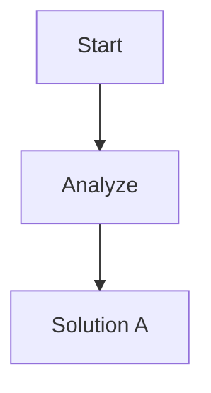

# Technology Stack

**Project:** SmartB Diagrams v2.1 -- Bug Fixes & Usability Improvements
**Researched:** 2026-02-19
**Scope:** NO new npm dependencies. Internal patterns only: annotation persistence, write serialization, browser-side interaction tracking, CSS splitting. All solutions use existing stack (Node.js fs, vanilla JS, CSS).

---

## Overview: Zero New Dependencies

This milestone adds NO new packages. Every fix uses existing Node.js APIs, the existing annotation regex system, and vanilla browser APIs. The project constraint of minimal dependencies is fully respected.

| Fix Area | Technology | Already Available |
|----------|-----------|-------------------|
| Ghost path persistence | `%% @ghost` annotation + existing `parseAllAnnotations` | `node:fs/promises`, existing regex parser |
| Write safety | Promise-chain write lock (already in DiagramService) | Existing `withWriteLock` pattern |
| Automatic heatmap tracking | `IntersectionObserver` + `PointerEvent` | Browser native APIs |
| CSS modularization | Plain CSS file splitting | `<link>` tags in live.html |

---

## 1. Ghost Path Persistence -- `@ghost` Annotation Format

### The Problem

Ghost paths are stored only in-memory (`GhostPathStore` -- a `Map<string, GhostPath[]>`). Server restart loses all ghost paths. The MCP `record_ghost_path` tool writes to memory but never touches the `.mmd` file.

### The Solution: Extend the Existing Annotation System

Add `%% @ghost` as a new annotation type inside the existing `%% --- ANNOTATIONS ---` block, following the exact same pattern as `@flag`, `@status`, `@breakpoint`, and `@risk`.

**Format:**

```
%% @ghost fromNodeId toNodeId "optional label"
```

**Regex (follows existing patterns):**

```typescript
// Existing patterns for reference:
// FLAG_REGEX   = /^%%\s*@flag\s+(\S+)\s+"([^"]*)"$/
// STATUS_REGEX = /^%%\s*@status\s+(\S+)\s+(\S+)$/
// RISK_REGEX   = /^%%\s*@risk\s+(\S+)\s+(high|medium|low)\s+"([^"]*)"$/

// New:
const GHOST_REGEX = /^%%\s*@ghost\s+(\S+)\s+(\S+)(?:\s+"([^"]*)")?$/;
//                                   ^from   ^to       ^label (optional)
```

**Example .mmd file with ghost annotations:**



### CRITICAL: Dual Parser Problem

The annotation system is **duplicated** between backend TypeScript and frontend vanilla JS:

| Component | Backend | Frontend |
|-----------|---------|----------|
| Regex definitions | `annotations.ts` lines 6-9 | `annotations.js` lines 11-14 |
| Parser | `parseAllAnnotations()` (annotations.ts:26-82) | `parseAnnotations()` (annotations.js:37-57) |
| Stripper | `stripAnnotations()` (annotations.ts:108-138) | `stripAnnotations()` (annotations.js:59-70) |
| Injector | `injectAnnotations()` (annotations.ts:145-196) | `injectAnnotations()` (annotations.js:72-83) |

**The frontend `injectAnnotations()` (annotations.js:72-83) only serializes 4 types: flags, statuses, breakpoints, risks.** It does NOT know about ghost paths. Whenever the browser saves via `injectAnnotations()` (e.g., when a user adds a flag, changes a status, or triggers any annotation save), `stripAnnotations()` removes the entire annotation block -- including `@ghost` lines -- and `injectAnnotations()` re-writes only the 4 types it knows about. **Ghost paths are silently destroyed.**

This means adding `@ghost` to the backend alone is NOT sufficient. The frontend parser must ALSO be updated.

**Required changes in both parsers:**

1. Add `GHOST_REGEX` to `annotations.js` (1 line)
2. Add `state.ghosts` array to `annotations.js` state object
3. Add ghost parsing inside `parseAnnotations()` in `annotations.js` (4 lines)
4. Add ghost serialization inside `injectAnnotations()` in `annotations.js` (3 lines)
5. Mirror all changes in `annotations.ts` (backend)
6. Write cross-validation test: feed same input to both parsers, verify identical output

### Alternative: `.smartb/ghost-paths.json` (Avoids Dual Parser)

If the dual-parser risk is deemed too high for this milestone, an alternative is to persist ghost paths in `.smartb/ghost-paths.json` keyed by file path. This avoids touching either parser.

```json
{
  "diagrams/plan.mmd": [
    { "fromNodeId": "B", "toNodeId": "D", "label": "Rejected: too complex", "timestamp": 1708012345000 },
    { "fromNodeId": "B", "toNodeId": "E", "label": "Rejected: insufficient data", "timestamp": 1708012346000 }
  ]
}
```

| Approach | Verdict | Tradeoff |
|----------|---------|----------|
| `@ghost` in annotation block | **PREFERRED** (if both parsers are updated) | Consistent with existing pattern. Single source of truth. Version-controlled. Requires updating both parsers. |
| `.smartb/ghost-paths.json` | **SAFE ALTERNATIVE** (avoids dual parser) | Splits truth between `.mmd` and sidecar. Sidecar can desync on file rename/move. NOT version-controlled. But avoids touching the annotation parsers entirely. |

**Recommendation:** Use `@ghost` annotations BUT update BOTH parsers (backend + frontend) in the same commit with cross-validation tests. If timeline pressure exists, use `.smartb/` as fallback.

### Integration Points

**In `annotations.ts` (backend):**

1. Add `GHOST_REGEX` constant (1 line)
2. Add `ghosts: GhostPath[]` to `AllAnnotations` interface
3. Add ghost path matching block inside `parseAllAnnotations` (6 lines)
4. Add ghost path serialization inside `injectAnnotations` (8 lines)

**In `annotations.js` (frontend) -- MUST also update:**

1. Add `GHOST_REGEX` constant (1 line)
2. Add `state.ghosts = []` to state object
3. Add ghost parsing in `parseAnnotations()` (4 lines)
4. Add ghost serialization in `injectAnnotations()` (3 lines)

**In `service.ts`:**

1. Add `getGhostPaths(filePath)` method (delegates to `readAllAnnotations`)
2. Add `addGhostPath(filePath, fromNodeId, toNodeId, label?)` (uses `modifyAnnotation`)
3. Add `removeGhostPath(filePath, fromNodeId, toNodeId)` (uses `modifyAnnotation`)
4. Add `clearGhostPaths(filePath)` (uses `modifyAnnotation`)

**In `ghost-store.ts`:**

The `GhostPathStore` in-memory store remains as a cache but is now backed by file persistence. On server startup, ghost paths are loaded from the `.mmd` file annotations. On ghost path creation, both the in-memory store AND the file annotation are updated.

**In `ghost-path-routes.ts` and `mcp/tools.ts`:**

The POST handler and `record_ghost_path` tool now call `service.addGhostPath()` instead of only `ghostStore.add()`. The `ghostStore` becomes a read-through cache populated from file annotations on first access.

**In `mcp/tools.ts` -- `update_diagram` deadlock prevention:**

The `update_diagram` tool (tools.ts:63-131) currently calls `service.writeDiagram()` first, then processes ghost paths via `ghostStore.add()`. If we change `ghostStore.add()` to also call `service.addGhostPath()` (which acquires the write lock), there is a deadlock risk: the write lock is still held from `writeDiagram()`, and `addGhostPath()` tries to acquire it again.

**Solution:** Extend `injectAnnotations()` to accept ghost paths. Then `writeDiagram()` writes everything (content + statuses + risks + ghost paths) in a single atomic write. No second lock acquisition needed.

**Confidence: HIGH for the annotation extension pattern. MEDIUM for dual-parser synchronization (requires careful testing).**

---

## 2. Write Safety -- Unified Write Lock

### The Problem

The `/save` endpoint in `file-routes.ts` writes directly to disk via `writeFile()`, bypassing `DiagramService.withWriteLock()`. If the MCP tool calls `service.writeDiagram()` at the same time the browser saves via `/save`, they can clobber each other.

**Current write paths:**

| Writer | Uses Write Lock? | File |
|--------|-----------------|------|
| `service.writeDiagram()` | YES | `service.ts` line 119 |
| `service.modifyAnnotation()` | YES (via `withWriteLock`) | `service.ts` line 70 |
| `/save` endpoint | **NO** | `file-routes.ts` line 51 |
| `/delete` endpoint | n/a (unlink, not write) | `file-routes.ts` line 76 |
| `/move` endpoint | n/a (rename) | `file-routes.ts` line 124 |

### The Solution: Route `/save` Through DiagramService

**Change `file-routes.ts`:**

Replace the raw `writeFile(resolved, body.content, 'utf-8')` with `service.writeDiagram(body.filename, body.content)`.

This is a ~3 line change:

```typescript
// BEFORE (file-routes.ts line 49-51):
const resolved = resolveProjectPath(projectDir, body.filename);
await mkdir(path.dirname(resolved), { recursive: true });
await writeFile(resolved, body.content, 'utf-8');

// AFTER:
await service.writeDiagram(body.filename, body.content);
```

**Important:** Call `service.writeDiagram(filePath, content)` with NO optional annotation parameters. Looking at `_writeDiagramInternal` (service.ts:139): `if (flags || statuses || breakpoints || risks)` -- when none are passed, content is written as-is without annotation processing. This preserves any annotations already embedded in the content from the browser editor.

The existing `withWriteLock` in `DiagramService` already handles:
- Promise-chain serialization per file path
- Lock cleanup when no more writes are queued
- Error propagation without breaking the chain

### Write Lock Performance

The existing write lock pattern (`withWriteLock`) adds near-zero latency for non-contended writes. It chains promises: `prev.then(fn)`. When there is no previous write, `prev` is `Promise.resolve()` which resolves in the microtask queue (~0.001ms). This is well within the 5ms budget.

For contended writes (two writers to the same file simultaneously), the second write waits for the first to complete. A typical `writeFile` to an SSD takes 0.5-2ms. Total worst-case latency: ~2ms per write in the contention case.

**No new code needed** -- the lock already exists. The fix is routing `/save` through it.

### Why Not Other Approaches

| Approach | Verdict | Reason |
|----------|---------|--------|
| **Route through DiagramService** | **USE THIS** | Zero new code for the lock itself. Single chokepoint for all writes. Already tested. |
| `node:fs/promises` advisory lock (`flock`) | REJECT | `flock` is POSIX-only (no Windows). Node.js does not expose `flock` natively. Would need `fs-ext` npm package. Overkill for single-process writes. |
| Mutex library (`async-mutex`) | REJECT | New dependency. The existing promise-chain pattern does the same thing with zero deps. |
| Write-ahead log (WAL) | REJECT | Complexity overkill. WAL is for databases, not for writing small text files. |
| File rename pattern (write to `.tmp`, rename) | MAYBE for future | Atomic rename prevents partial writes. But the current `writeFile` with `utf-8` encoding writes the full buffer atomically on modern Node.js (< 2MB). Not needed for .mmd files. |

**Confidence: HIGH** -- the write lock pattern already works for 4 annotation types. This just routes the last unprotected writer through it.

---

## 3. Automatic Heatmap Tracking -- Browser Interaction Events

### The Problem

Heatmap data currently requires explicit MCP session recording (`start_session` + `record_step` for each `node:visited` event). Users do not get heatmap data from manual browsing -- only from AI agent sessions. The heatmap is therefore rarely useful.

### The Solution: Passive Browser-Side Interaction Tracking

Track user interactions with diagram nodes automatically in the browser, without requiring MCP sessions. Send aggregated data to the server periodically.

**What to track (browser-side):**

| Interaction | How to Detect | Event |
|-------------|--------------|-------|
| Node click | `click` event on `.node` / `.smartb-node` elements | `node:clicked` |
| Node hover (>500ms) | `pointerenter`/`pointerleave` with timeout | `node:hovered` |
| Node visible (>2s in viewport) | `IntersectionObserver` on node elements | `node:viewed` |
| Ghost path viewed | Ghost path toggle ON while file has ghosts | `ghost:viewed` |

**Browser-side implementation (`interaction-tracker.js`, ~120 lines):**

```javascript
// Pattern: accumulate counts in a local Map, flush to server every 30s
var SmartBTracker = (function() {
    var counts = {};  // { nodeId: number }
    var FLUSH_INTERVAL = 30000; // 30 seconds
    var MIN_HOVER_MS = 500;
    var hoverTimers = {};

    function increment(nodeId) {
        counts[nodeId] = (counts[nodeId] || 0) + 1;
    }

    function flush() {
        var file = SmartBFileTree.getCurrentFile();
        if (!file || Object.keys(counts).length === 0) return;
        var payload = { file: file, counts: counts };
        counts = {};
        // POST to server (fire-and-forget)
        fetch((window.SmartBBaseUrl || '') + '/api/heatmap/' +
            encodeURIComponent(file), {
            method: 'POST',
            headers: { 'Content-Type': 'application/json' },
            body: JSON.stringify(payload),
        }).catch(function() {}); // silent fail
    }

    // ... event listeners on diagram nodes
    // ... IntersectionObserver for viewport tracking
    // ... setInterval(flush, FLUSH_INTERVAL)

    return { init: init, flush: flush };
})();
```

**Server-side: New POST endpoint for `/api/heatmap/:file`:**

Add to `session-routes.ts` (or a new `heatmap-routes.ts`):

```typescript
// POST /api/heatmap/:file -- Merge interaction counts into heatmap data
routes.push({
  method: 'POST',
  pattern: new RegExp('^/api/heatmap/(?<file>.+)$'),
  handler: async (req, res, params) => {
    const file = decodeURIComponent(params['file']!);
    const body = await readJsonBody<{ counts: Record<string, number> }>(req);
    // Merge into existing heatmap data (accumulate counts)
    await sessionStore.mergeHeatmapCounts(file, body.counts);
    sendJson(res, { ok: true });
  },
});
```

**Server-side storage: Extend `SessionStore`:**

Add a new method `mergeHeatmapCounts(file, counts)` that stores interaction counts in `.smartb/heatmap.json` (one JSON object mapping `file -> { nodeId -> count }`). The counts from browser interactions and MCP sessions are merged when `getHeatmapData()` is called.

### Browser APIs Used (All Native, Zero Dependencies)

| API | Purpose | Browser Support |
|-----|---------|-----------------|
| `IntersectionObserver` | Detect which nodes are visible in the viewport | All modern browsers (Chrome 51+, Firefox 55+, Safari 12.1+) |
| `PointerEvent` (pointerenter/pointerleave) | Hover tracking with unified mouse/touch | All modern browsers |
| `fetch` | POST counts to server | Already used throughout the app |
| `setInterval` | Periodic flush | Universal |
| `performance.now()` | Precise timing for hover duration | Universal |

### Performance Guardrails

| Concern | Mitigation |
|---------|-----------|
| Too many event listeners | Delegate all events on `#preview` container, not per-node |
| Frequent flush blocking UI | `fetch` is async, fire-and-forget, no `await` |
| IntersectionObserver overhead | Create ONE observer, observe all `.node`/`.smartb-node` elements. Re-observe after `diagram:rendered` event |
| Memory growth | `counts` object is flushed and reset every 30s. Max ~500 keys (one per node) |
| Server write contention | Heatmap POST writes to a separate file, not the `.mmd` file. No lock contention with diagram writes |
| IntersectionObserver staleness | SVG is replaced on re-render. Re-observe on `diagram:rendered` event via `SmartBEventBus` |

### Why Not Other Approaches

| Approach | Verdict | Reason |
|----------|---------|--------|
| **Passive browser tracking + periodic flush** | **USE THIS** | Zero impact on render performance. No new deps. Automatic (user does not need to start a session). Merges cleanly with MCP session data. |
| `rrweb` session recording | REJECT | 50KB+ library. Records DOM mutations, not diagram interactions. Wrong level of abstraction. |
| Google Analytics / Plausible | REJECT | External service. This is a local-first tool. No cloud dependencies. |
| MutationObserver on SVG | REJECT | Fires on every SVG re-render (zoom, pan, drag), not on user intent. Would generate noise, not signal. |
| Record every event in real-time via WebSocket | REJECT | Adds WebSocket traffic for every hover/click. Batched POST every 30s is much more efficient. |

**Confidence: HIGH** -- IntersectionObserver and PointerEvent are well-established browser APIs. The batched POST pattern is standard for analytics.

---

## 4. CSS Modularization -- Splitting `main.css` (577 Lines)

### The Problem

`main.css` at 577 lines exceeds the project's 500-line limit. It contains styles for 8+ distinct UI components mixed together. The project already has a good splitting pattern (see below), but `main.css` was not fully decomposed.

### Current CSS Architecture (Already Partially Split)

```
static/
  tokens.css          (76 lines)  -- Design tokens (CSS custom properties)
  main-layout.css     (220 lines) -- Layout: sidebar, editor, preview, resize
  main.css            (577 lines) -- PROBLEM: mixed component styles
  annotations.css     (367 lines) -- Flag system, editor popovers
  breakpoints.css     (69 lines)  -- Breakpoint indicators
  heatmap.css         (74 lines)  -- Heatmap legend, toggle
  session-player.css  (137 lines) -- Session replay UI
  search.css          (103 lines) -- Search overlay
  modal.css           (109 lines) -- Modal dialogs
```

The splitting pattern is already established: one CSS file per feature/component. `main.css` is the last file that needs decomposition.

### The Solution: Extract 3-4 Component Files from `main.css`

Analyzing the content of `main.css` (577 lines), it contains these distinct sections:

| Section | Lines | Extract To |
|---------|-------|-----------|
| Reset + body | 1-9 | Keep in `main.css` (global reset) |
| Topbar + toolbar buttons | 10-167 | `toolbar.css` (~160 lines) |
| Zoom controls | 210-251 | `zoom.css` (~42 lines) |
| Toast | 255-272 | Keep in `main.css` (global utility) |
| Kbd | 274-282 | Keep in `main.css` (global utility) |
| Help overlay | 284-314 | Keep in `main.css` (global utility) |
| Breadcrumb bar | 334-381 | `breadcrumb.css` (~48 lines) |
| Auto-collapse notice | 383-421 | Keep in `main.css` (feature utility) |
| Focus mode | 423-430 | Keep in `main.css` (global modifier) |
| Context menu | 432-461 | `context-menu.css` (~30 lines) |
| Selection | 463-466 | Keep in `main.css` (global utility) |
| Sidebar tabs | 468-486 | Keep in `main.css` or merge with `main-layout.css` |
| MCP session cards | 488-577 | `mcp-sessions.css` (~90 lines) |

**After split:**

| File | Lines | Content |
|------|-------|---------|
| `main.css` | ~210 | Reset, body, toast, kbd, help, collapse notice, focus mode, selection, sidebar tabs |
| `toolbar.css` | ~160 | Topbar, toolbar groups, toolbar buttons, badges, workspace switcher, status dot |
| `context-menu.css` | ~30 | Context menu, menu items, separators, risk colors |
| `mcp-sessions.css` | ~90 | MCP session cards, headers, file lists, dividers, empty state |

**Optional additional splits (if `main.css` still feels large):**

| File | Lines | Content |
|------|-------|---------|
| `breadcrumb.css` | ~48 | Breadcrumb bar, items, separator, exit button |
| `zoom.css` | ~42 | Zoom controls, zoom button, zoom label |

### Implementation

1. Create new CSS files in `static/`
2. Cut sections from `main.css` and paste into new files
3. Add `<link rel="stylesheet">` tags to `live.html` (after `main.css`)
4. Verify no CSS specificity changes (all selectors are flat class-based, no nesting issues)

**No build tool needed.** CSS files are served as static assets. The `<link>` tags in `live.html` already follow this exact pattern for the 7 existing extracted CSS files.

### Why This Approach

| Approach | Verdict | Reason |
|----------|---------|--------|
| **Plain CSS file splitting** | **USE THIS** | Follows existing pattern. Zero tooling. Zero build changes. Easy to verify (just move classes). |
| CSS Modules | REJECT | Requires a build step (PostCSS/webpack). This project uses vanilla JS with no CSS build. |
| CSS-in-JS | REJECT | No JS framework. Cannot inline styles in vanilla JS IIFEs without a build step. |
| Sass/SCSS | REJECT | Adds a preprocessor build step. The project explicitly avoids build tools for static assets. |
| Shadow DOM / Web Components | REJECT | Would require refactoring all vanilla JS modules into custom elements. Massive scope creep. |
| Single file with region comments | REJECT | Does not solve the 500-line limit. Comments do not reduce cognitive load when editing. |

**Confidence: HIGH** -- the project already has 7 extracted CSS files following this exact pattern. This is just completing the decomposition.

---

## Recommended Stack (Unchanged)

No changes to `package.json`. All solutions use existing capabilities.

### Core (Unchanged)

| Technology | Version | Purpose | Role in v2.1 |
|------------|---------|---------|--------------|
| Node.js | >= 22 | Runtime | `node:fs/promises` for ghost path persistence |
| TypeScript | ~5.9 | Language | Type-safe annotation extensions |
| tsup | ^8.5.1 | Build | No changes needed |
| vitest | ^4.0.18 | Tests | Test new annotation parsing, write lock coverage |

### Server (Unchanged)

| Technology | Version | Purpose | Role in v2.1 |
|------------|---------|---------|--------------|
| ws | ^8.19.0 | WebSocket | Broadcasts ghost path updates (already works) |
| @modelcontextprotocol/sdk | ^1.26.0 | MCP server | `record_ghost_path` now persists to file |
| zod | ^4.3.6 | Schema validation | No changes |

### Browser (Unchanged + New Vanilla JS Module)

| Technology | Version | Purpose | Role in v2.1 |
|------------|---------|---------|--------------|
| Vanilla JS | n/a | Browser UI | New `interaction-tracker.js` module |
| Native SVG DOM | n/a | Diagram rendering | No changes |
| `IntersectionObserver` | Browser native | Viewport node tracking | New: auto heatmap |
| `PointerEvent` | Browser native | Hover/click tracking | New: auto heatmap |

---

## Files to Create

| File | Size | Purpose |
|------|------|---------|
| `static/interaction-tracker.js` | ~120 lines | Passive node interaction tracking for heatmap |
| `static/toolbar.css` | ~160 lines | Extracted from main.css |
| `static/context-menu.css` | ~30 lines | Extracted from main.css |
| `static/mcp-sessions.css` | ~90 lines | Extracted from main.css |

## Files to Modify

| File | Change | Size Impact |
|------|--------|-------------|
| `src/diagram/annotations.ts` | Add `GHOST_REGEX`, parse/inject ghost annotations | +30 lines |
| `src/diagram/types.ts` | GhostPath already exists, no change needed | 0 |
| `src/diagram/service.ts` | Add `getGhostPaths`, `addGhostPath`, `removeGhostPath`, `clearGhostPaths` | +40 lines |
| `src/server/file-routes.ts` | Route `/save` through `service.writeDiagram()` | -2 / +1 lines |
| `src/server/ghost-path-routes.ts` | Call `service.addGhostPath()` in POST handler | ~5 lines changed |
| `src/server/ghost-store.ts` | Add `loadFromAnnotations()` for cache population | +15 lines |
| `src/mcp/tools.ts` | `record_ghost_path` calls `service.addGhostPath()` | ~3 lines changed |
| `src/session/session-store.ts` | Add `mergeHeatmapCounts()` method | +25 lines |
| `src/server/session-routes.ts` | Add POST `/api/heatmap/:file` route | +20 lines |
| **`static/annotations.js`** | **Add GHOST_REGEX, parse/inject ghost paths (CRITICAL)** | **+15 lines** |
| `static/main.css` | Remove extracted sections | -370 lines |
| `static/live.html` | Add 4 new `<link>` and 1 `<script>` tag | +5 lines |

---

## Installation

```bash
# No npm install needed. Zero new dependencies.
# All changes are internal code modifications.
```

---

## What NOT to Add

| Avoid | Why | Use Instead |
|-------|-----|-------------|
| `async-mutex` / `p-mutex` | Existing promise-chain write lock works identically | `DiagramService.withWriteLock()` |
| `rrweb` | Records DOM, not diagram interactions | Native `IntersectionObserver` + `PointerEvent` |
| `better-sqlite3` | Overkill for storing ghost path annotations | `.mmd` annotation block |
| Analytics libraries | This is local-first, no cloud | Vanilla JS tracker + periodic POST |
| Sass/PostCSS | No CSS build pipeline exists or is needed | Plain CSS file splitting |
| `lodash.debounce` | 1 line of vanilla JS does this | `setTimeout`/`clearTimeout` |

---

## Sources

- [Node.js `fs/promises` API](https://nodejs.org/api/fs.html#fspromiseswritefilefile-data-options) -- `writeFile` atomicity for files < buffer size. **HIGH confidence.**
- [IntersectionObserver API (MDN)](https://developer.mozilla.org/en-US/docs/Web/API/IntersectionObserver) -- Browser support, performance characteristics. **HIGH confidence.**
- [PointerEvent API (MDN)](https://developer.mozilla.org/en-US/docs/Web/API/PointerEvent) -- Unified mouse/touch events. **HIGH confidence.**
- Existing codebase: `src/diagram/annotations.ts` -- backend annotation regex pattern with 4 types. **HIGH confidence (primary source).**
- Existing codebase: `static/annotations.js` -- frontend annotation parser, DUPLICATED logic. Lines 37-57 parse 4 types; lines 72-83 inject 4 types. **HIGH confidence (primary source).**
- Existing codebase: `src/diagram/service.ts` -- `withWriteLock` pattern at line 35-46. **HIGH confidence (primary source).**
- Existing codebase: `src/server/ghost-store.ts` -- in-memory ghost path store. **HIGH confidence (primary source).**
- Existing codebase: `static/main.css` -- 577 lines, 8+ component sections identified. **HIGH confidence (primary source).**
- Existing codebase: `static/live.html` -- CSS loading pattern with 8 `<link>` tags. **HIGH confidence (primary source).**

---

*Stack research for: SmartB Diagrams v2.1 -- Bug Fixes & Usability Improvements*
*Researched: 2026-02-19*
